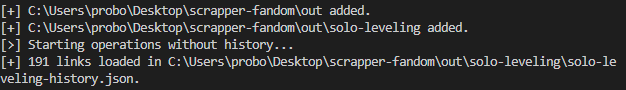
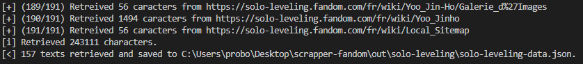
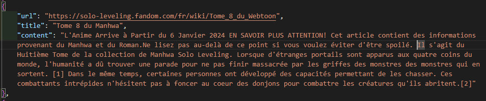

## Introduction

This script is used to scrape data from most of the wikis on fandom.com. It retrieves only the text contained in a given div, and can be easily adjusted via `class/Analyzer.mjs`.

## Installation

### npm

```sh
npm install
npm start
```

### pnpm

```sh
pnpm install
pnpm start
```

## Configuration

You can change :

-   The source fandom
-   The source of the page containing the register of all pages
-   The name of the subfolder to be created in `out/`
-   The name of the file containing the scrapped page content
-   the name of the file containing the history of links present on the wiki.

```js
// Base url of some fandom's wiki ex: https://some-wiki.fandom.com without '/' at end.
const from = "https://naruto.fandom.com";

// https://some-wiki.fandom.com/wiki/Special:AllPages or https://some-wiki.fandom.com/fr/wiki/Sp%C3%A9cial:Toutes_les_pages
const entry_point_from_all_pages =
    "https://naruto.fandom.com/fr/wiki/Sp%C3%A9cial:Toutes_les_pages?from=%22Gaara%22...%21%21";

// Name of the subfolder to be created in out/ (Default: some-wiki relative to "from" variable).
const sub_dir = new URL(from).hostname.split(".")[0];

// Data file name.
const filename_data = `${sub_dir}-data.json`;

// History file name.
const filename_history = `${sub_dir}-history.json`;
```

## Example

I want to scrape the contents of the Solo Leveling fandom wiki page.

### Minimal configuration

```js
const from = "https://solo-leveling.fandom.com";
const entry_point_from_all_pages =
    "https://solo-leveling.fandom.com/fr/wiki/Sp%C3%A9cial:Toutes_les_pages";
```

### Processing

1. Preparing future links to visit in order to capture text data.



2. Retrieving page content.



3. Collecting data in `out/solo-leveling/solo-leveling-data.json`.



## Licence

This project is licensed by MIT.
